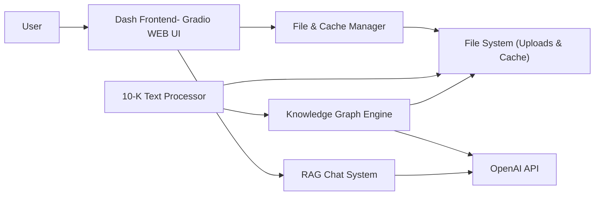
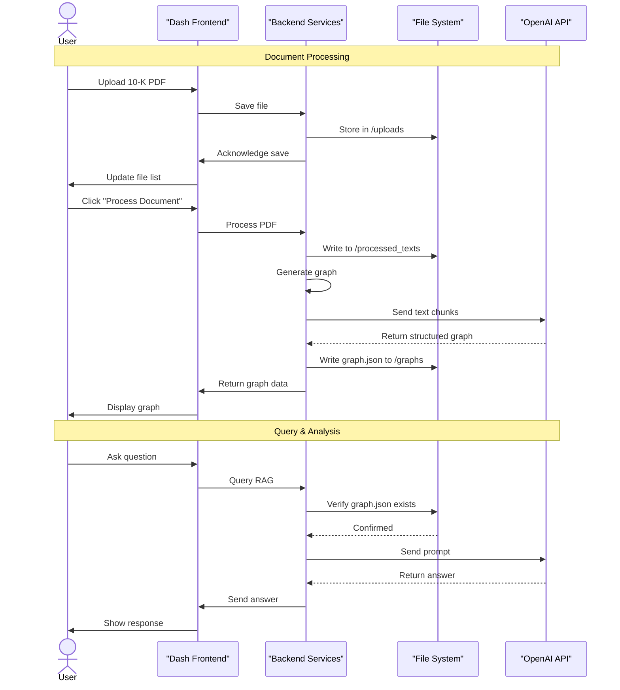

# Form10k_Graph_RAG_Analyzer

## Table of Contents
- [Overview: From Documents to Decisions](#overview-from-documents-to-decisions)  
- [What is a Knowledge Graph?](#what-is-a-knowledge-graph)  
- [What is RAG?](#what-is-rag)  
- [The Power of Combining KG & RAG for 10-Ks](#the-power-of-combining-kg--rag-for-10-ks)  
- [Features](#features)  
- [System Architecture](#system-architecture)  
- [Getting Started: A Beginner-Friendly Guide](#getting-started-a-beginner-friendly-guide)  
  - [Step 1: Set Up Your Workspace](#step-1-set-up-your-workspace)  
  - [Step 2: Install the Necessary Tools](#step-2-install-the-necessary-tools)  
  - [Step 3: Connect to the AI Brain](#step-3-connect-to-the-ai-brain)  
  - [Step 4: Launch the Application](#step-4-launch-the-application)  
- [How to Use the Suite: A Quick Manual](#how-to-use-the-suite-a-quick-manual)  
- [Project Directory Structure](#project-directory-structure)  

---

## Overview: From Documents to Decisions
Knowledge Graph–based RAG systems often outperform traditional vector-based RAGs because they capture contextual relations between entities more accurately.

While many frameworks for KG generation exist, they typically run on a single thread and lack a purpose-defined scheme to consistently map entities, relationships, and events into a consistent node–edge structure.

This project is an attempt to create more optimal ontologies specifically for SEC Form 10-K filings. It introduces a simplified scheme that enables faster KG construction by leveraging two-thread parallelism.

This system is built on OpenAI’s API, with knowledge graphs stored as well-defined local structures, avoiding reliance on external web-based graph databases. Deployment is handled through a Gradio interface for ease of use..

---

## Knowledge Graph
A **Knowledge Graph (KG)** represents information as a network of **entities (nodes)** and **relationships (edges)**.  

Complex knowledge graphs can be expensive to generate and may induce high latency.

---

### Example: A Complex High latency inducing KG 
<p align="center">
  
</p>

---

An optimal graph captures key entity–relationship pairs **without duplication**—especially important for long, information-dense 10-K documents.

---

### Example: A More Optimal KG
<p align="center">
  
</p>

---

### Ontology of Entities
The first step towards an optimal KG is to define the entity ontology:  

<p align="center">
  
</p>

---

### Entity Extraction
For a given document **D**:  

<p align="center">
  

</p>

---

### Relation Formation
We use an LLM to induce relations between extracted entities.  

Let the relation set be:  
**R = {OWNS, OPERATES, REPORTS, SUBJECT TO, MENTIONS, ASSOCIATED WITH}**

Extracted edge set:  

<p align="center">
  
</p>

---

### Relation Examples
<p align="center">
  
</p>

---

### Knowledge Graph Definition
<p align="center">
  
</p>

---

### Form 10-K as a Graph
In short, A typical Form 10-K graph looks like:  

<p align="center">
  
</p>

---

### Example Structured Queries
- “What risks are linked to UnitedHealth Group in 2024?”  
- “Which segments contribute to reported revenue?”  

---
## Base RAG
**Retrieval-Augmented Generation (RAG)** combines **retrieval** and **generation**.  

Before answering, the system retrieves **relevant context** (here, from the knowledge graph) to ground responses in verifiable information.

---

## Combining KG & RAG for 10-Ks
Combining KG and RAG yields structured, context-aware answers.  

Instead of matching text fragments, the system **follows graph connections** to answer questions such as:
- “What risks are linked to the Optum Health segment?”  
- “Which executives are associated with the company’s primary revenue sources?”  

This provides **faster, more accurate insights** than simple text search.

---

## Features
- **Interactive Dashboard** – Professional, multi-tab UI for streamlined workflows.  
- **Intelligent 10-K Parsing** – Extraction of key sections for focused analysis.  
- **Comprehensive Knowledge Graph** – High-precision mapping of entities and relationships.  
- **Immersive Graph Explorer** – Interactive visualization with zoom, drag, and pan.  
- **Conversational Q&A** – KG-RAG integration for grounded answers.  
- **Efficient File Management** – PDF uploads, caching, and secure deletion.  
- **Responsive Performance** – Asynchronous background processing.  

---

## System Architecture
The **Dash frontend (Gradio web UI)** provides the user interface.  
The **Python backend** manages parsing, graph generation, retrieval, and API communication.

---

### Architecture Overview


---

### Overall Workflow 


---

## Getting Started:

### Step 1: Set Up Your Workspace
```bash
git clone <your-repository-url>
cd corporate-filing-analysis-suite
```

### Step 2: Install the Necessary Tools
```bash
# Windows
python -m venv venv
.
env\Scripts ctivate

# macOS/Linux
python3 -m venv venv
source venv/bin/activate

pip install -r requirements.txt
```

### Step 3: Connect to the AI Brain
```bash
OPENAI_API_KEY="sk-..."
```

### Step 4: Launch the Application
```bash
python app.py
```

Then open **The local gradio URL that appears on your terminal** in your browser.

---

## How to Use the Suite:

### Document Management
- **Upload** a 10-K PDF.  
- **Process** to extract text and generate the graph.  
- **Delete** a file and its cached artifacts when no longer needed.  

### Graph Explorer
- **View** the generated knowledge graph.  
- **Interact** with nodes: drag, zoom, and inspect relationships.  

### Query & Analysis
- **Select** a processed document.  
- **Ask** questions; the system responds using KG-RAG context.  

---

## Project Directory Structure
```
corporate-filing-analysis-suite/
├── .env
├── .gitignore
├── app.py
├── requirements.txt
├── src/
│   ├── __init__.py
│   ├── file_manager.py
│   ├── graph_generator.py
│   ├── graph_rag.py
│   └── text_processor.py
└── assets/
    └── styles.css
```


