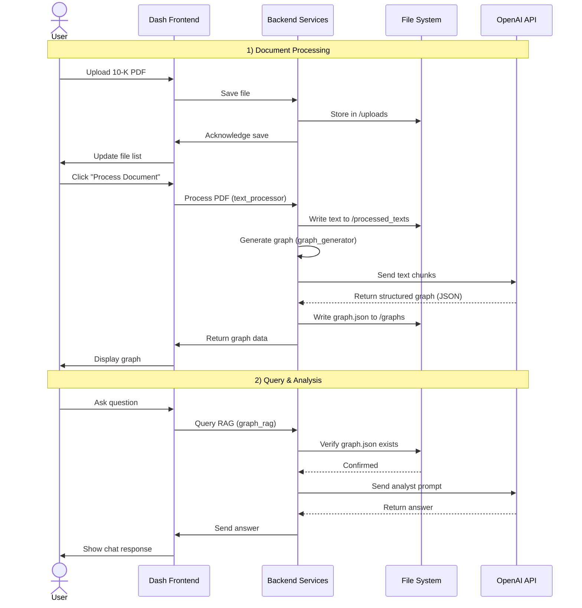

# Corporate Filing Analysis Suite

## Table of Contents
- [Overview: From Documents to Decisions](#overview-from-documents-to-decisions)
- [What is a Knowledge Graph?](#what-is-a-knowledge-graph)
- [What is RAG?](#what-is-rag)
- [The Power of Combining KG & RAG for 10-Ks](#the-power-of-combining-kg--rag-for-10-ks)
- [Features](#features)
- [System Architecture](#system-architecture)
- [Getting Started: A Beginner-Friendly Guide](#getting-started-a-beginner-friendly-guide)
  - [Step 1: Set Up Your Workspace](#step-1-set-up-your-workspace)
  - [Step 2: Install the Necessary Tools](#step-2-install-the-necessary-tools)
  - [Step 3: Connect to the AI Brain](#step-3-connect-to-the-ai-brain)
  - [Step 4: Launch the Application](#step-4-launch-the-application)
- [How to Use the Suite: A Quick Manual](#how-to-use-the-suite-a-quick-manual)
- [Project Directory Structure](#project-directory-structure)

---

## Overview: From Documents to Decisions
The **Corporate Filing Analysis Suite** assists in interpreting complex financial documents, particularly SEC Form 10-Ks. These filings are converted into interactive knowledge graphs so that users can visualize entities and relationships and pose natural‑language questions for focused, evidence‑based answers.

---

## What is a Knowledge Graph?
A **Knowledge Graph (KG)** represents information as a network of entities (nodes) and relationships (edges). For Form 10-Ks, the ontology of entities is:

$$
\mathcal{E} = \{ \text{Company}, \text{Segment}, \text{Risk}, \text{Financial}, \text{Regulation}, \text{Executive}, \text{Event} \}
$$

Entities extracted from a document $D$ are:
$$
\mathcal{V}(D) = \{ v_1, v_2, \ldots, v_n \}, \quad v_k \in \mathcal{E}.
$$

Relations between entities are:
$$
R(D) = \{ (v_i, r, v_j) \mid v_i, v_j \in \mathcal{V}(D),\ r \in \mathcal{R} \},
$$
with
$$
\mathcal{R} = \{ \texttt{OWNS}, \texttt{OPERATES}, \texttt{REPORTS}, \texttt{SUBJECT\_TO}, \texttt{MENTIONS}, \texttt{ASSOCIATED\_WITH} \}.
$$

**Examples**
$$
(\text{UnitedHealth Group}, \texttt{OWNS}, \text{Optum Health}) \\
(\text{UnitedHealth Group}, \texttt{REPORTS}, \text{Revenue = \$372B}) \\
(\text{UnitedHealth Group}, \texttt{SUBJECT\_TO}, \text{Regulatory risk})
$$

The knowledge graph is:
$$
\mathcal{G}(D) = (\mathcal{V}, \mathcal{E}).
$$

---

## What is RAG?
**Retrieval‑Augmented Generation (RAG)** combines retrieval and generation: before producing an answer, the system retrieves relevant context (here, from the knowledge graph) to ground its response in verifiable information.

---

## The Power of Combining KG & RAG for 10-Ks
Combining KG and RAG yields structured, context‑aware answers. Instead of matching text fragments, the system follows connections in the graph to address questions such as:
- “What risks are linked to the Optum Health segment?”
- “Which executives are associated with the company’s main revenue sources?”

This results in faster, more accurate insights than simple text search.

---

## Features
- **Interactive Dashboard**: Professional, multi‑tab UI for streamlined workflows.  
- **Intelligent 10‑K Parsing**: Extraction of key sections for focused analysis.  
- **Comprehensive Knowledge Graph**: High‑precision mapping of entities and relationships.  
- **Immersive Graph Explorer**: Interactive visualization with zoom, drag, and pan.  
- **Conversational Q&A**: KG‑RAG integration for grounded answers.  
- **Efficient File Management**: PDF uploads, caching, and secure deletion.  
- **Responsive Performance**: Asynchronous background processing.  

---

## System Architecture
The **Dash frontend** provides the user interface. The **Python backend** manages parsing, graph generation, retrieval, and API communication.

### Simplified Architecture Diagram
```mermaid
graph TD
    subgraph User_Interface
        A[Dash Frontend (app.py)]
    end

    subgraph Backend_Services_Python
        B[File & Cache Manager
file_manager.py]
        C[10-K Text Processor
text_processor.py]
        D[Knowledge Graph Engine
graph_generator.py]
        E[RAG Chat System
graph_rag.py]
    end

    subgraph External_and_Storage
        F[OpenAI API (gpt-4o)]
        G[File System (Uploads & Cache)]
    end

    A --> B
    A --> E
    B --> G
    C --> D
    D --> F
    E --> F
    C --> G
    D --> G
```

### Detailed Workflow Diagram


---

## Getting Started: A Beginner-Friendly Guide

### Step 1: Set Up Your Workspace
Clone the repository or download the source as a ZIP archive.
```bash
git clone <your-repository-url>
cd corporate-filing-analysis-suite
```

### Step 2: Install the Necessary Tools
Create and activate a virtual environment, then install dependencies.
```bash
# Windows
python -m venv venv
.
env\Scripts ctivate

# macOS/Linux
python3 -m venv venv
source venv/bin/activate

pip install -r requirements.txt
```

### Step 3: Connect to the AI Brain
Create a `.env` file in the project root:
```bash
OPENAI_API_KEY="sk-..."
```

### Step 4: Launch the Application
```bash
python app.py
```
Open **http://127.0.0.1:8050** in your browser.

---

## How to Use the Suite: A Quick Manual

### Document Management
- **Upload** a 10‑K PDF.  
- **Process** the document to extract text and generate the graph.  
- **Delete** a file and its cached artifacts when no longer needed.  

### Graph Explorer
- **View** the generated knowledge graph.  
- **Interact** by moving nodes and zooming to inspect relationships.  

### Query & Analysis
- **Select** a processed document.  
- **Ask** questions; the system responds using KG‑RAG context.  

---

## Project Directory Structure
```
corporate-filing-analysis-suite/
├── .env
├── .gitignore
├── app.py
├── requirements.txt
├── src/
│   ├── __init__.py
│   ├── file_manager.py
│   ├── graph_generator.py
│   ├── graph_rag.py
│   └── text_processor.py
└── assets/
    └── styles.css
```
