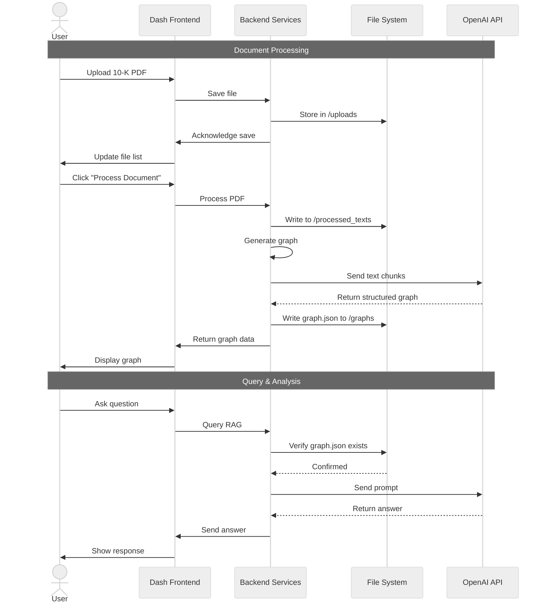

# Corporate Filing Analysis Suite

## Table of Contents
- [Overview: From Documents to Decisions](#overview-from-documents-to-decisions)
- [What is a Knowledge Graph?](#what-is-a-knowledge-graph)
- [What is RAG?](#what-is-rag)
- [The Power of Combining KG & RAG for 10-Ks](#the-power-of-combining-kg--rag-for-10-ks)
- [Features](#features)
- [System Architecture](#system-architecture)
- [Getting Started: A Beginner-Friendly Guide](#getting-started-a-beginner-friendly-guide)
  - [Step 1: Set Up Your Workspace](#step-1-set-up-your-workspace)
  - [Step 2: Install the Necessary Tools](#step-2-install-the-necessary-tools)
  - [Step 3: Connect to the AI Brain](#step-3-connect-to-the-ai-brain)
  - [Step 4: Launch the Application](#step-4-launch-the-application)
- [How to Use the Suite: A Quick Manual](#how-to-use-the-suite-a-quick-manual)
- [Project Directory Structure](#project-directory-structure)

---

## Overview: From Documents to Decisions
The **Corporate Filing Analysis Suite** assists in interpreting complex financial documents, particularly SEC Form 10‑K filings. These filings are converted into interactive knowledge graphs so that users can visualize entities and relationships and ask natural‑language questions for targeted, evidence‑based answers.

---

## What is a Knowledge Graph?
A **Knowledge Graph (KG)** represents information as a network of entities (nodes) and relationships (edges). Complex knowledge graphs can be expensive to generate and may induce high latency. An optimal graph captures key entity–relationship pairs without duplication—especially important for long, information‑dense 10‑K documents.

For 10‑Ks, the entity ontology is:
$$
\mathcal{E}=\{\mathrm{Company},\mathrm{Segment},\mathrm{Risk},\mathrm{Financial},\mathrm{Regulation},\mathrm{Executive},\mathrm{Event}\}
$$

Entities extracted from a document \(D\) are
$$
\mathcal{V}(D)=\{v_1,\dots,v_n\},\quad v_k\in\mathcal{E}.
$$

Relations between entities are
$$
R(D)=\{(v_i,r,v_j)\mid v_i,v_j\in\mathcal{V}(D),\ r\in\mathcal{R}\},
$$
with
$$
\mathcal{R}=\{\mathrm{OWNS},\mathrm{OPERATES},\mathrm{REPORTS},\mathrm{SUBJECT\_TO},\mathrm{MENTIONS},\mathrm{ASSOCIATED\_WITH}\}.
$$

**Examples:**
$$
(\mathrm{UnitedHealth\ Group},\ \mathrm{OWNS},\ \mathrm{Optum\ Health}),\quad
(\mathrm{UnitedHealth\ Group},\ \mathrm{REPORTS},\ \mathrm{Revenue}=\$372\,\mathrm{B}),\quad
(\mathrm{UnitedHealth\ Group},\ \mathrm{SUBJECT\_TO},\ \mathrm{Regulatory\ risk}).
$$

The knowledge graph is
$$
\mathcal{G}(D)=(\mathcal{V},\mathcal{E}).
$$

> **Tip:** On GitHub, view the Markdown file (not Raw). KaTeX math will not render in Raw view.

---

## What is RAG?
**Retrieval‑Augmented Generation (RAG)** combines retrieval and generation. Before answering, the system retrieves relevant context (here, from the knowledge graph) to ground responses in verifiable information.

---

## The Power of Combining KG & RAG for 10-Ks
Combining KG and RAG yields structured, context‑aware answers. Instead of matching text fragments, the system follows connections in the graph to answer questions such as:
- “What risks are linked to the Optum Health segment?”  
- “Which executives are associated with the company’s primary revenue sources?”

This provides faster, more accurate insights than simple text search.

---

## Features
- **Interactive Dashboard**: Professional, multi‑tab UI for streamlined workflows.  
- **Intelligent 10‑K Parsing**: Extraction of key sections for focused analysis.  
- **Comprehensive Knowledge Graph**: High‑precision mapping of entities and relationships.  
- **Immersive Graph Explorer**: Interactive visualization with zoom, drag, and pan.  
- **Conversational Q&A**: KG‑RAG integration for grounded answers.  
- **Efficient File Management**: PDF uploads, caching, and secure deletion.  
- **Responsive Performance**: Asynchronous background processing.  

---

## System Architecture
The **Dash frontend** provides the user interface. The **Python backend** manages parsing, graph generation, retrieval, and API communication.

### Simplified Architecture Diagram (GitHub‑safe, high‑contrast)
```mermaid
%%{init: {"theme": "neutral"}}%%
flowchart LR
    U([User])
    A([Dash Frontend])
    B([File & Cache Manager])
    C([10-K Text Processor])
    D([Knowledge Graph Engine])
    E([RAG Chat System])
    F([OpenAI API])
    G([File System (Uploads & Cache)])

    style U fill:#ffffff,stroke:#000000,stroke-width:2px,color:#000000
    style A fill:#ffffff,stroke:#000000,stroke-width:2px,color:#000000
    style B fill:#ffffff,stroke:#000000,stroke-width:2px,color:#000000
    style C fill:#ffffff,stroke:#000000,stroke-width:2px,color:#000000
    style D fill:#ffffff,stroke:#000000,stroke-width:2px,color:#000000
    style E fill:#ffffff,stroke:#000000,stroke-width:2px,color:#000000
    style F fill:#ffffff,stroke:#000000,stroke-width:2px,color:#000000
    style G fill:#ffffff,stroke:#000000,stroke-width:2px,color:#000000

    U --> A
    A --> B
    A --> E
    B --> G
    C --> D
    D --> F
    E --> F
    C --> G
    D --> G
```

### Detailed Workflow Diagram (GitHub‑safe, high‑contrast)


---

## Getting Started: A Beginner-Friendly Guide

### Step 1: Set Up Your Workspace
Clone the repository or download the source as a ZIP archive.
```bash
git clone <your-repository-url>
cd corporate-filing-analysis-suite
```

### Step 2: Install the Necessary Tools
Create and activate a virtual environment, then install dependencies.
```bash
# Windows
python -m venv venv
.\venv\Scripts\activate

# macOS/Linux
python3 -m venv venv
source venv/bin/activate

pip install -r requirements.txt
```

### Step 3: Connect to the AI Brain
Create a `.env` file in the project root:
```bash
OPENAI_API_KEY="sk-..."
```

### Step 4: Launch the Application
```bash
python app.py
```
Open **http://127.0.0.1:8050** in your browser.

---

## How to Use the Suite: A Quick Manual

### Document Management
- **Upload** a 10‑K PDF.  
- **Process** the document to extract text and generate the graph.  
- **Delete** a file and its cached artifacts when no longer needed.  

### Graph Explorer
- **View** the generated knowledge graph.  
- **Interact** by moving nodes and zooming to inspect relationships.  

### Query & Analysis
- **Select** a processed document.  
- **Ask** questions; the system responds using KG‑RAG context.  

---

## Project Directory Structure
```
corporate-filing-analysis-suite/
├── .env
├── .gitignore
├── app.py
├── requirements.txt
├── src/
│   ├── __init__.py
│   ├── file_manager.py
│   ├── graph_generator.py
│   ├── graph_rag.py
│   └── text_processor.py
└── assets/
    └── styles.css
```
